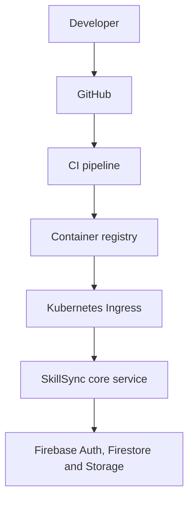

# SkillSyncAI

CI Run Test 2
CI Run Test 3


SkillSync is a Flask learning and mentoring platform. The current product remains a single deployable **core service** because its UI, routes, models, and workflows share one database and do not yet have stable service contracts. The repository is prepared for future extraction of authentication or notifications without pretending those are independent services today.

## Architecture



The application keeps the existing server-rendered routes and Socket.IO behavior. Firebase Authentication handles identity, Cloud Firestore stores application data, and Firebase Storage is available for uploaded files.

## Technologies

- Python 3.12, Flask, Flask-Login, Flask-SocketIO
- Firebase Authentication, Cloud Firestore, and Firebase Storage
- Docker, Docker Compose, Kubernetes, and Kustomize
- Firebase Admin SDK as an optional external integration

## Environment setup

```sh
cp .env.example .env
```

Set `SESSION_SECRET` before using Compose. `FIREBASE_SERVICE_ACCOUNT_KEY` accepts an injected file path or inline JSON; credentials are never copied into the image. Set `FIREBASE_REQUIRED=true` when Firebase must be available for the deployment.

Important variables are `FLASK_ENV`, `SESSION_SECRET`, `HOST`, `PORT`, `FIREBASE_PROJECT_ID`, `FIREBASE_SERVICE_ACCOUNT_KEY`, `FIREBASE_REQUIRED`, and `ADMIN_BOOTSTRAP_TOKEN`.

## Run with Python

```sh
python -m venv .venv
. .venv/bin/activate
python -m pip install -r requirements.txt
cp .env.example .env
python app.py
```

Open `http://localhost:5000`. The process health endpoint is `GET /health`.

### Local Firebase credentials

Fork owners must use their own Firebase project and service account. Download a
service-account JSON file from Firebase Console, keep it outside Git, and point
the local `.env` file at it:

```sh
chmod 600 /absolute/path/to/firebase-service-account.json
```

```dotenv
FIREBASE_SERVICE_ACCOUNT_KEY=/absolute/path/to/firebase-service-account.json
FIREBASE_REQUIRED=true
```

Set the Firebase client variables in `.env` as well if browser Firebase
features are enabled. Alternatively, leave `FIREBASE_REQUIRED=false` and the
application will run locally without Firebase integration. Never commit the
service-account JSON, `.env`, or inline service-account JSON to the fork.

## Run with Docker

Build and run the versioned image:

```sh
docker build -t kumarreddy1902/skillsync:0.1.0 .
docker run --env-file .env -p 5000:5000 kumarreddy1902/skillsync:0.1.0
```

## Run with Docker Compose

Compose starts the Firebase-backed core service:

```sh
docker compose up --build
```

## Kubernetes

The manifests live under `infrastructure/kubernetes/base`. Jenkins creates the
runtime Secret from Jenkins Credentials before applying the base:

```sh
kubectl create namespace skillsync
kubectl create secret generic skillsync-secrets -n skillsync \
  --from-literal=SESSION_SECRET="$SESSION_SECRET" \
  --from-file=FIREBASE_SERVICE_ACCOUNT_KEY="$FIREBASE_SERVICE_ACCOUNT_KEY"
kubectl apply -k infrastructure/kubernetes/base
```

The `Jenkinsfile` builds and pushes an immutable Docker Hub tag, pulls that tag
to verify it, and waits up to two minutes for approval before deploying it to
Kubernetes. Configure Jenkins credentials named `dockerhub_credentials` and
`kubeconfig`, and configure the GitHub push webhook for automatic pipeline
triggers. The deployment includes CPU and memory requests/limits plus liveness
and readiness probes on `/health`; do not use `latest`.

## Testing

```sh
pytest
```

The test suite includes the health contract and does not require a local database.

## Security and operations

- Secrets are loaded from environment variables and `.env` is ignored by Git.
- Service-account files are ignored by both Git and Docker builds.
- Production requires `SESSION_SECRET` and `FIREBASE_SERVICE_ACCOUNT_KEY`.
- Gunicorn serves the container on `0.0.0.0:5000` as a non-root user.
- Firestore collections are created on demand by the Firebase Admin SDK.
- Firebase failures are logged by type without credential paths or payloads. Set `FIREBASE_REQUIRED=true` to fail startup when Firebase is mandatory.
