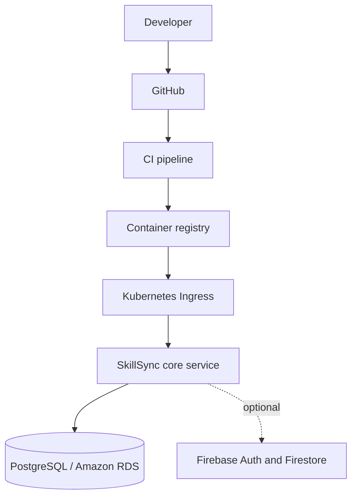

# SkillSyncAI

CI Run Test 2
CI Run Test 3


SkillSync is a Flask learning and mentoring platform. The current product remains a single deployable **core service** because its UI, routes, models, and workflows share one database and do not yet have stable service contracts. The repository is prepared for future extraction of authentication or notifications without pretending those are independent services today.

## Architecture



The application keeps the existing server-rendered routes and Socket.IO behavior. SQLite is suitable for local Python development; production and multi-replica deployments should use PostgreSQL or Amazon RDS.

## Technologies

- Python 3.12, Flask, Flask-SQLAlchemy, Flask-Login, Flask-SocketIO
- SQLite for local development and PostgreSQL for production
- Docker, Docker Compose, Kubernetes, and Kustomize
- Firebase Admin SDK as an optional external integration

## Environment setup

```sh
cp .env.example .env
```

Set `SESSION_SECRET` and `POSTGRES_PASSWORD` before using Compose. `FIREBASE_SERVICE_ACCOUNT_KEY` accepts an injected file path or inline JSON; credentials are never copied into the image. Set `FIREBASE_REQUIRED=true` when Firebase must be available for the deployment.

Important variables are `FLASK_ENV`, `SESSION_SECRET`, `DATABASE_URL`, `HOST`, `PORT`, `FIREBASE_PROJECT_ID`, `FIREBASE_SERVICE_ACCOUNT_KEY`, `FIREBASE_REQUIRED`, and `ADMIN_BOOTSTRAP_TOKEN`.

## Run with Python

SQLite is the default:

```sh
python -m venv .venv
. .venv/bin/activate
python -m pip install -r requirements.txt
cp .env.example .env
python init_db.py
python app.py
```

Open `http://localhost:5000`. The process health endpoint is `GET /health`.

### Local Firebase credentials

Fork owners must use their own Firebase project and service account. Download a
service-account JSON file from Firebase Console, keep it outside Git, and point
the local `.env` file at it:

```sh
chmod 600 /absolute/path/to/firebase-service-account.json
```

```dotenv
FIREBASE_SERVICE_ACCOUNT_KEY=/absolute/path/to/firebase-service-account.json
FIREBASE_REQUIRED=true
```

Set the Firebase client variables in `.env` as well if browser Firebase
features are enabled. Alternatively, leave `FIREBASE_REQUIRED=false` and the
application will run locally without Firebase integration. Never commit the
service-account JSON, `.env`, or inline service-account JSON to the fork.

## Run with Docker

Build and run the versioned image:

```sh
docker build -t skillsync/core-service:0.1.0 .
docker run --env-file .env -p 5000:5000 skillsync/core-service:0.1.0
```

For a local SQLite container, set `DB_AUTO_CREATE=true` and leave `DATABASE_URL=sqlite:///skillsync.db`. Production containers should use an external PostgreSQL database and run migrations as a release operation rather than creating tables in every web worker.

## Run with Docker Compose

Compose starts PostgreSQL and the core service:

```sh
docker compose up --build
```

The database volume is named `postgres_data`. Stop and remove it with `docker compose down -v` when resetting local data.

## Kubernetes

The manifests live under `infrastructure/kubernetes/base`. Create the runtime Secret outside source control, then apply the base:

```sh
kubectl create namespace skillsync
kubectl create secret generic skillsync-secrets -n skillsync \
  --from-literal=SESSION_SECRET="$SESSION_SECRET" \
  --from-literal=DATABASE_URL="$DATABASE_URL" \
  --from-literal=FIREBASE_SERVICE_ACCOUNT_KEY="$FIREBASE_SERVICE_ACCOUNT_KEY"
kubectl apply -k infrastructure/kubernetes/base
```

The deployment uses `skillsync/core-service:0.1.0`; CI/CD should promote immutable version tags. It includes CPU and memory requests/limits plus liveness and readiness probes on `/health`. Do not place secret values in YAML or commit generated Secret manifests.

## Testing

```sh
pytest
```

The test suite includes the health contract and uses an isolated temporary SQLite database.

## Security and operations

- Secrets are loaded from environment variables and `.env` is ignored by Git.
- Service-account files are ignored by both Git and Docker builds.
- Production requires `SESSION_SECRET` and a non-SQLite `DATABASE_URL`.
- Gunicorn serves the container on `0.0.0.0:5000` as a non-root user.
- Database creation is explicit through `init_db.py`; it is not performed when Gunicorn imports the app.
- Firebase failures are logged by type without credential paths or payloads. Set `FIREBASE_REQUIRED=true` to fail startup when Firebase is mandatory.
